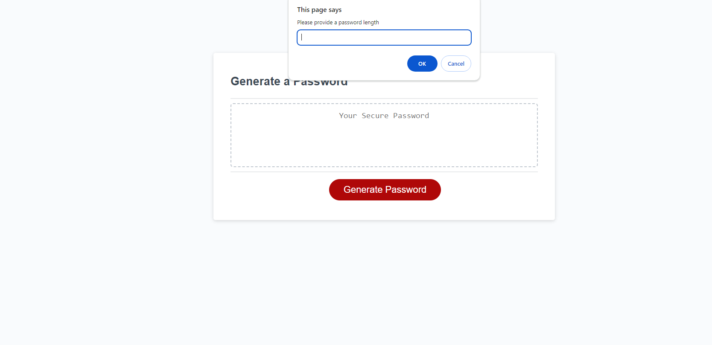

## Password Generator
This is a simple web application that allows users to generate random passwords based on their selected criteria. The application runs in the browser and features a clean and polished user interface that adapts to multiple screen sizes.

## Features 
Generates passwords with customizable criteria

## Usage 
Open the application in your web browser.

Click on the "Generate Password" button.

Follow the prompts to select your desired password criteria.

Once you have made your selections, the generated password will appear in the text box.

## Technologies Used

HTML

CSS

JavaScript

## License 
This project is licensed under the MIT License.

## Contact 
For any questions or feedback, please feel free to contact me at danielxstella@gmail.com

[Link to password generator ] ( https://dann9109.github.io/jspasswordgenerator/)